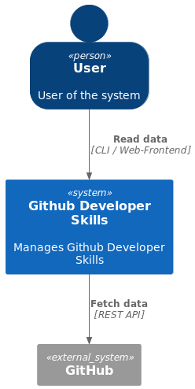
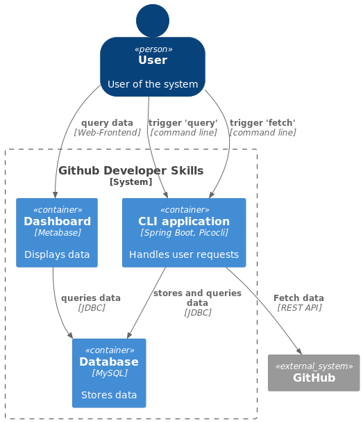
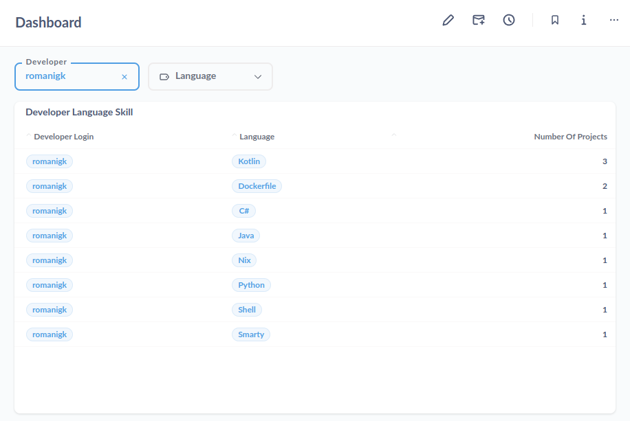
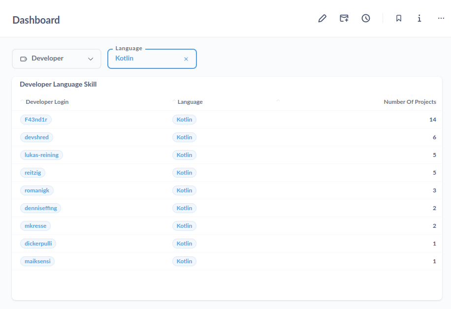

# Github Developer Skills

Coding test for my application for [codecentric](https://www.codecentric.de/) in Nov 2023. The current task can be found at [Aufgabe.pdf](doc/Aufgabe.pdf)

## Tools / Libraries

* Tools
  * Java 11
  * Maven
  * IntelliJ Idea Community Edition
  * Metabase
* Libraries
  * Spring Boot 2.7
  * Lombok
  * Prettier
  * JPA + Hibernate
  * Picocli

## How to build / run

The project's dependencies and build is maintained via Maven but currently works best from an IDE.
To start the application use the integration-test like entry point tests located in `de.codecentric.github.developer.skills.ApplicationTest`.
As a pre-requisite a local database is required. Use the [docker compose file](src/main/resources/database/docker-compose.yml) to start it.
After the database is up and running the different entry points to the application can be used.
The application's sources are formatted via Prettier, execute `mvn validate`.

## How it works internally

The main application is a CLI.
It mainly separates into data fetching and data querying.
The following C4 models give you an overview about the different aspects

### System context view

### Container view

## Solution

1. Within the database all relevant information (developers, repositories, and sources) are stored.
2. The CLI provides a fetch command that lists all developers with there number of project per language. The developers are sorted by name, the languages are sorted by number of projects.
3. The easy-to-use web application is realized via Metabase, see below.

## Metabase

As a simple tool for visualizing data and querying information a Metabase dashboard is used.
As there is no simple way to serialize the configuration for questions and dashboards this is not persisted in this repository and only available on my local system during the presentation.
To give you an idea here is the result for querying for a specific developer:

This shows the result for querying for a specific developer:

Key for making this possible is a suitable data layout within the database.

## Notes, Learnings, Problems

* had problems to set up the project on a blank system without my usual templates
* IntelliJ Idea Community Edition lacks essential features regarding Spring and databases
* DON'T place `Application` class into the root package, this will fail due to an initialization error in `r2dbc`
* almost no real unit tests available
* almost no logging
* poor output via `System.out.println()`
* as I did not implement an update mechanism, data truncation was necessary which is also poorly implemented
* anonymous calls to the GitHub API have a rate limit that forced me to hack authorized calls into it in the middle of development
* Metabase is super powerful regarding data visualization but the community version offers not simple way to serialize configuration of questions and dashboards